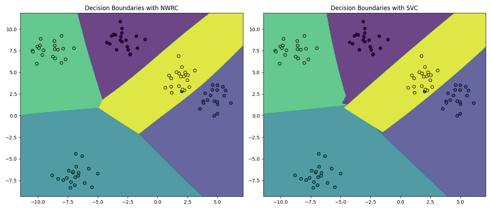
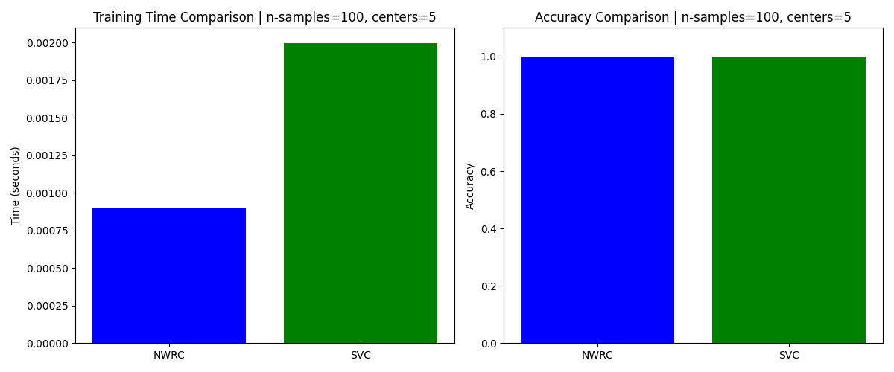
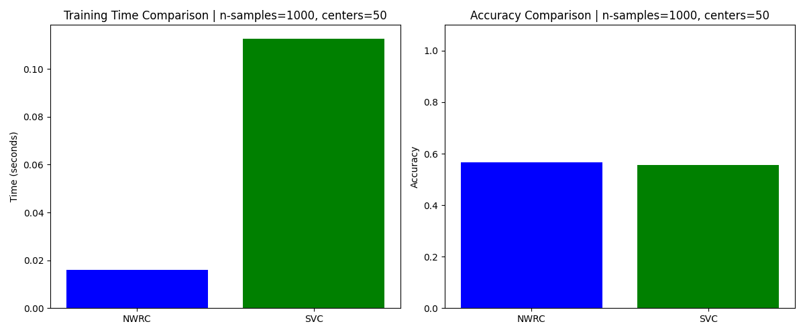

# Nadaraya-Watson Ridge Classifier: Advanced Machine Learning Model

## Overview

The Nadaraya-Watson Ridge Classifier combines the robustness of Ridge Regression with the flexibility of Nadaraya-Watson kernel smoothing. This hybrid approach offers a robust solution for non-linear classification problems, overcoming the limitations of traditional ridge regression models.

### Key Features

- **Ridge Regression**: Tackle overfitting problems by introducing an L2 regularization term.
- **Nadaraya-Watson Kernel Smoothing**: Non-linear mapping of input features to labels.
- **Custom Kernel Support**: Use predefined or custom kernel functions.
- **Sparse Data Compatible**: Built to handle sparse data efficiently.
- **Concurrency**: Utilizes multi-threading for large datasets to expedite computation.

## Table of Contents

1. [Requirements](#requirements)
2. [Installation](#installation)
3. [Usage](#usage)
    - [Simple Example](#simple-example)
    - [Advanced Usage](#advanced-usage)
4. [Performance Comparison](#performance-comparison)
    - [Decision Boundaries for 5 Classes](#decision-boundaries-for-5-classes)
    - [Model Comparison for 5 Classes](#model-comparison-for-5-classes)
    - [Model Comparison for 50 Classes](#model-comparison-for-50-classes)

## Requirements

### Software

- Python 3.x

### Python Packages

- NumPy
- SciPy

## Installation

To get started with the Nadaraya-Watson Ridge Classifier library, follow these steps:

1. Clone this repository:

    ```bash
    !git clone https://github.com/guyfloki/Nadaraya-Watson-Ridge-Classifier.git
    cd Nadaraya-Watson-Ridge-Classifier
    ```

2. Install required Python packages:

    ```bash
    pip install numpy scipy
    ```

## Usage

### Simple Example

Here's how you can quickly get started:

```python
from models.nadaraya_watson_ridge_classifier import NadarayaWatsonRidgeClassifier
import numpy as np

# Create training and test datasets
X_train = np.random.rand(100, 2)
y_train = np.concatenate([np.array([0, 1, 2]).repeat(33), np.array([0])])
X_test = np.random.rand(10, 2)

# Initialize and fit the model
model = NadarayaWatsonRidgeClassifier(alpha=1.0, h=0.5)
model.fit(X_train, y_train)

# Make predictions
y_pred = model.predict(X_test)
```
## Advanced Usage

This library offers several advanced features:

- **Custom Kernel Functions**: You can pass a custom kernel function when initializing the model.
- **Weight Decay in AdamW Optimizer**: The AdamW optimizer supports weight decay, offering better generalization in some cases.
- **Thread Pooling for Large Datasets**: The model employs a thread pool to compute the Nadaraya-Watson estimator for large datasets.

## Performance Comparison

### Decision Boundaries for 5 Classes



### Model Comparison for 5 Classes



### Model Comparison for 50 Classes


